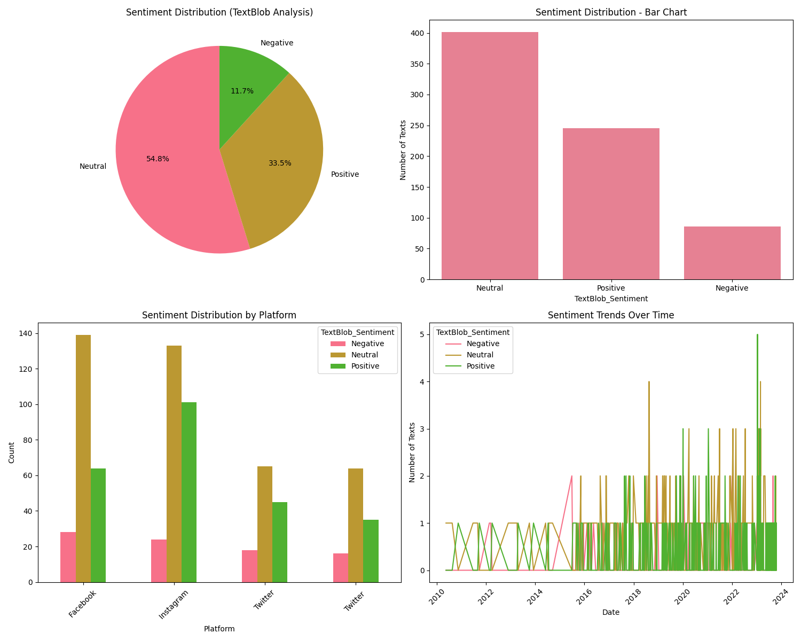
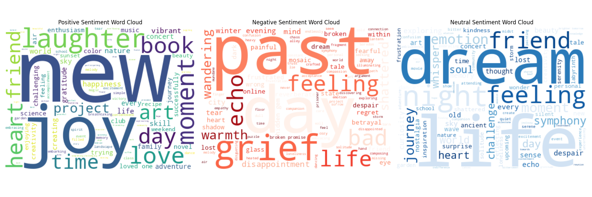
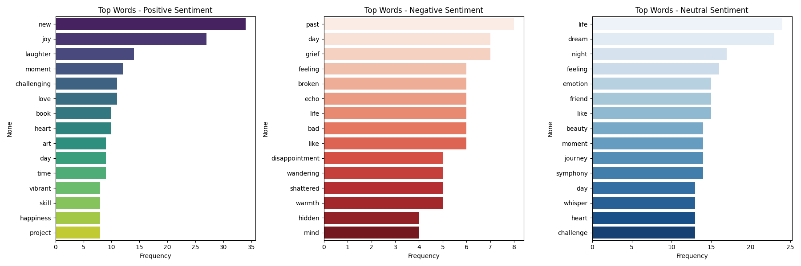

# 📊 Sentiment Analysis on Social Media Comments

This project analyzes user-generated comments from social media platforms to uncover emotional tone, sentiment polarity, and keyword patterns. It applies text preprocessing, sentiment scoring, and visualization techniques to support business insights and engagement strategies.

---

## 1. Introduction

**Problem Statement:**  
Understanding public sentiment is crucial for brands, campaigns, and platforms to respond effectively to user feedback.

**Objectives:**  
- Classify comments as positive, negative, or neutral  
- Visualize sentiment distribution and keyword trends  
- Explore emotional and topical patterns in user responses

**Business Context:**  
Sentiment analysis enables organizations to monitor brand perception, detect emerging issues, and tailor communication strategies based on user emotions.

---

## 2. Data Preparation

**Loading Steps:**  
Comments are loaded from a structured dataset simulating social media responses.

**Cleaning Process:**  
Text is lowercased, stripped of punctuation, stopwords, and non-alphabetic characters.

**Data Validation:**  
Null values and duplicates are removed to ensure clean input for sentiment scoring.

**Feature Engineering:**  
Polarity scores and sentiment labels are generated using TextBlob.

---

## 3. Exploratory Analysis

**Initial Visualizations:**  
- A pie chart shows that **Neutral comments dominate** (54.8%), followed by **Positive** (33.3%) and **Negative** (11.9%).  
- A bar chart confirms this distribution, with Neutral sentiment having the highest post count.  
- A grouped bar chart compares sentiment across platforms, revealing platform-specific sentiment biases.  
- A line chart tracks sentiment trends over time, highlighting fluctuations in user tone from 2014 to 2023.

**Statistical Summaries:**  
- Sentiment class counts: Neutral > Positive > Negative  
- Polarity scores range from –1 to +1, with a mean skewed slightly toward positivity

**Pattern Identification:**  
- Neutral comments are most frequent, often factual or non-emotive  
- Positive comments reflect appreciation and support  
- Negative comments, though fewer, signal dissatisfaction and potential risk areas  
- Temporal trends suggest sentiment shifts tied to external events or platform dynamics

---

## 4. Sentiment Classification

**Methodology Selection:**  
TextBlob is used for rule-based sentiment scoring based on polarity.

**Classification Results:**  
Comments are labeled as positive (>0), negative (<0), or neutral (=0).

**Threshold Decisions:**  
Default polarity thresholds are used; they can be tuned for domain-specific sensitivity.

---

## 5. WordCloud Visualization

**Generation Process:**  
Three separate WordClouds were generated from cleaned comment text, grouped by sentiment class: Positive, Negative, and Neutral. Each cloud highlights the most frequent words associated with that sentiment.

**Interpretation Framework:**  
Larger words indicate higher frequency and prominence within the sentiment category. Context is inferred based on emotional tone and thematic relevance.

**Key Insights:**  
- **Positive Sentiment**: Dominated by uplifting words like “joy”, “new”, “laughter”, “love”, and “friend”, reflecting enthusiasm and appreciation.
- **Negative Sentiment**: Features emotionally heavy terms such as “grief”, “past”, “loss”, and “disappointment”, indicating dissatisfaction or emotional distress.
- **Neutral Sentiment**: Includes balanced or ambiguous words like “dream”, “friend”, “life”, and “story”, often factual or reflective in nature.

---

---

## 7. Practical Applications

**Business Insights:**  
Identify what users appreciate or criticize most in real time.

**Actionable Recommendations:**  
Improve product features, customer service, or messaging based on sentiment trends.

**Risk Management:**  
Detect spikes in negative sentiment to mitigate reputational damage early.

---

## 8. Conclusion

**Key Findings Summary:**  
- The majority of comments are neutral (54.8%), with positive sentiment making up a third and negative sentiment being least frequent.  
- Sentiment distribution varies across platforms and fluctuates over time, revealing dynamic user engagement patterns.  
- WordClouds highlight emotionally charged keywords like “joy”, “grief”, and “dream”, offering a clear view into how users express sentiment.  
- TextBlob sentiment scoring enables fast, scalable classification of user feedback, supporting real-time monitoring and analysis.

**Limitations:**  
- No emotion or topic modeling yet  
- The dataset is simulated, not live-streamed

**Future Work:**  
- Integrate real-time data from Twitter or YouTube  
- Add emotion detection and topic modeling  
- Build an interactive dashboard for stakeholders

**Implementation Recommendations:**  
Use this workflow as a foundation for scalable sentiment monitoring in customer feedback systems.

---

